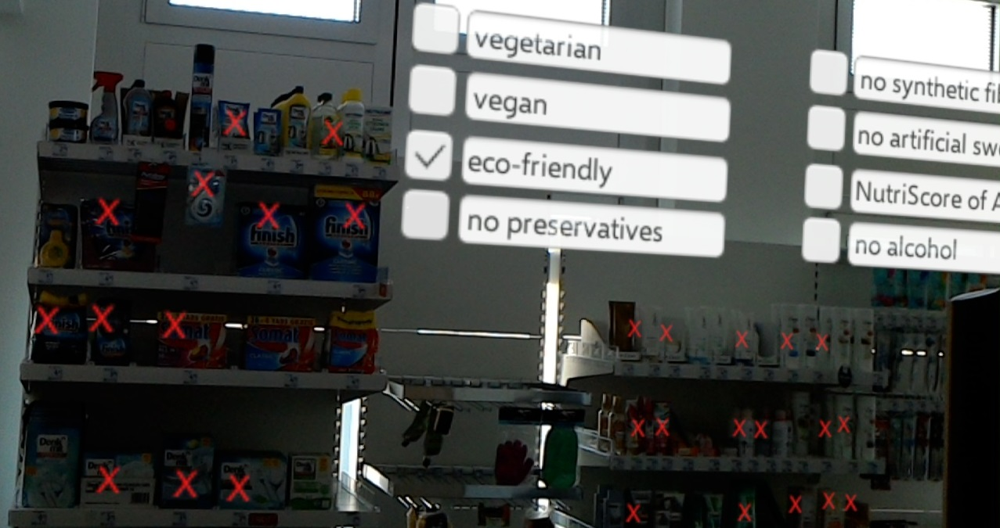
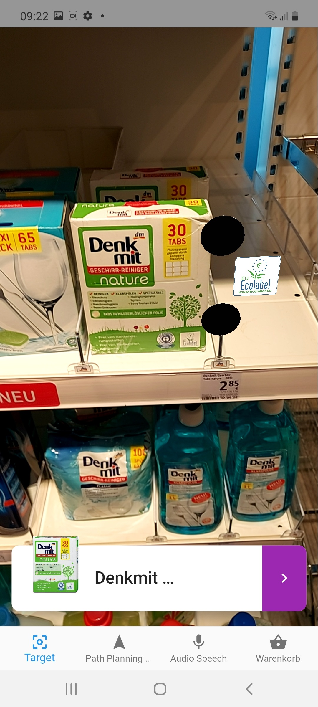
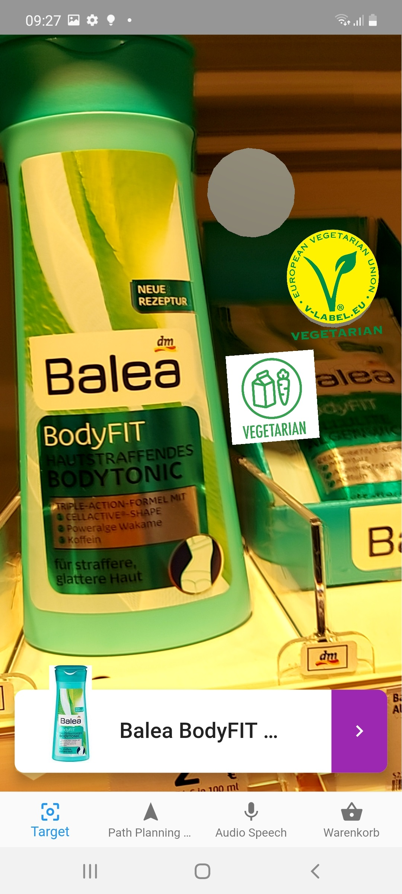

# NonFoodKG - A non-food product knowledge graph

Non-FoodKG is a non-food knowledge graph interlinking different ontologies designed for retail, household and robotic applications. It is based on a merged product taxonomy reflecting product classification in grocery stores and drugstores that is linked to a product location ontology created from a robot belief state while performing stocktaking in a retail store. The <b>product location ontology</b> therefore stores inventory data like stock and price of products as well as their positions relative to shelves (instead of coordinates). We use the <a href="http://knowrob.org/">KnowRob knowledge processing system</a> for creation of the location ontology. The <b>product taxonomy</b> classifies products that were recognized during stocktaking. It is linked to an <b>ingredients classification</b> based on string matching, which is connected to an <b>allergen classification</b>. The product taxonomy is also linked to further product information like name and place of production in <b>product information</b>,<b> product label</b> or <b>product dimensions</b>, i.e. dimensions of product packaging as well as product weight/ filling information. 

# Ontologies

Please check out version 1 of the ontologies here:

<h4>Version</h4> 1.0 is the first version of NonFoodKG. 
<h4>Version 1.1</h4> has some minor fixes and integrates a content trust feature based on the <a href="http://trdf.sourceforge.net/trustvocab.owl">tRDF</a> trust vocabulary in combination with a classification of data sources as <a href="http://www.ontologydesignpatterns.org/ont/dul/DUL.owl">DUL information objects</a>
<table> 
  <tr>
    <td><b>version 1.0</b></td><td><b>version 1.1</b></td> </tr>
<tr>
  <td><a href="https://raw.githubusercontent.com/K4R-IAI/AllIn-NonFoodKG/master/WebGraph/1.0/ProductTaxonomy.owl">Product Taxonomy</a></td>
  <td><a href="https://raw.githubusercontent.com/K4R-IAI/AllIn-NonFoodKG/master/WebGraph/1.1/ProductTaxonomy.owl">Product Taxonomy</a></td>
  </tr>
<tr>
<td><a href="https://raw.githubusercontent.com/K4R-IAI/AllIn-NonFoodKG/master/WebGraph/1.0/Ingredients.owl">Ingredients Ontology</a></td>
<td><a href="https://raw.githubusercontent.com/K4R-IAI/AllIn-NonFoodKG/master/WebGraph/1.1/Ingredients.owl">Ingredients Ontology</a></td>
  </tr>
  <tr>
<td><a href="https://raw.githubusercontent.com/K4R-IAI/AllIn-NonFoodKG/master/WebGraph/1.0/Allergen.owl">Allergen Ontology</a></td>
<td><a href="https://raw.githubusercontent.com/K4R-IAI/AllIn-NonFoodKG/master/WebGraph/1.1/Allergen.owl">Allergen Ontology</a></td>
  </tr>
  <tr>
<td><a href="https://raw.githubusercontent.com/K4R-IAI/AllIn-NonFoodKG/master/WebGraph/1.0/ProductInfo.owl">Product Information (nutrition) Ontology</a></td>
<td><a href="https://raw.githubusercontent.com/K4R-IAI/AllIn-NonFoodKG/master/WebGraph/1.1/ProductInfo.owl">Product Information (nutrition) Ontology</a></td>
  </tr>
  <tr>
<td><a href="https://raw.githubusercontent.com/K4R-IAI/AllIn-NonFoodKG/master/WebGraph/1.0/Label.owl">Product Label Ontology</a></td>
<td><a href="https://raw.githubusercontent.com/K4R-IAI/AllIn-NonFoodKG/master/WebGraph/1.1/Label.owl">Product Label Ontology</a></td>
</tr>
  <tr>
<td><a href="https://raw.githubusercontent.com/K4R-IAI/AllIn-NonFoodKG/master/WebGraph/1.0/ProductDimensions.owl">Product Dimensions Ontology</a></td>
<td><a href="https://raw.githubusercontent.com/K4R-IAI/AllIn-NonFoodKG/master/WebGraph/1.1/ProductDimensions.owl">Product Dimensions Ontology</a></td>
  </tr>
  <tr>
<td><a href="https://raw.githubusercontent.com/K4R-IAI/AllIn-NonFoodKG/master/WebGraph/1.0/ProductToShelf.owl">Product Location Ontology</a></td>
<td><a href="https://raw.githubusercontent.com/K4R-IAI/AllIn-NonFoodKG/master/WebGraph/1.1/ProductToShelf.owl">Product Location Ontology</a></td>
  </tr>
  </table>
# Motivation

Retail stores are competing with online stores. They are aiming at digitization of the shopping experiences. We believe that one main advantage of online stores is its connection to Web information. Consumer needs can be unique but also change fast. It would be very time-consuming to manually model consumer preferences in a database. The Semantic Web already offers much information, mainly for food products (e.g. https://world.openfoodfacts.org/ ). Unfortunately, it lacks information about non-food products like allergens contained in cosmetics. Therefore we created this non-food knowledge graph. 
To further enhance the knowledge graph information and in order to being able to apply the included knowledge in example applications, we also integrate location information from a perception-based system, leading to a unique embodiment of knowledge in various consumer and robot applications.

# Querying the knowledge graph

The knowledge graph is publicly available here and on <a href="https://triply.cc/">triply</a>, many thanks to the <a href="https://krr.cs.vu.nl/">knowledge representation and reasoning group</a> at the Vrije Universiteit Amsterdam.

It can be queried easily: <b><a href="http://grlc.io/api/K4R-IAI/NonFoodKG/SPARQLfiles/">Try out</a> some predefined queries</b> with the <a href="https://github.com/CLARIAH/grlc">grlc</a> api,the git repository linked data API constructor that automatically builds Web APIs using shared SPARQL queries. 

 
You can also query the dataset here: 
<h4>version 1.0:</h4> <a href="https://api.krr.triply.cc/datasets/mkumpel/NonFoodKG/services/NonFoodKG/sparql">NonFoodKG via triply SPARQL api</a>
<h4>version 1.1:</h4> <a href="https://api.krr.triply.cc/datasets/mkumpel/TrustNonFoodKG/services/TrustNonFoodKG/sparql">TrustNonFoodKG via triply SPARQL api</a>

# Use Cases

<table style="table-layout: fixed;width:100%;">
  <tr>
    <th colspan="2"><h4>Highlighting consumer preferences</h4></th>
  </tr>
  <tr>
    <td style="width:50%;">
Customers have different preferences. Searching for products that meet a given preference like cosmetics that do not contain alcohol can be exhausting. We created an AR application to ease this shopping task.
Based on the product taxonomy, location information in the product location ontology and ingredients information in the ingredients and allergen ontology, we created a consumer preference demo in AR.
      In this demo we used the query for organic products (among others),that can also be found in the predefined queries above.
</td>
  <td style="width:50%;">

  </td>
  </tr>
  <tr>
    <th colspan="2"><h4>Routing to product destination</h4></th>
  </tr>
  <tr>
    <td style="width:50%;">
Customers or store workers often search for product locations. We also created an AR demo based on the predefined query for product class locations in order to route a customer to a product destination.
    </td>
    <td style="width:50%;">

    </td>
  </tr>
  <tr>
    <th colspan="2"><h4>Highlighting product information</h4></th>
  </tr>
  <tr>
    <td style="width:50%;">
Customers might be interested in product information. We created an AR app for a Smartphone to highlight interesting product information like awarded labels or ingredients. Additionally, products can be added to a shopping cart.
    </td>
    <td style="width:50%;">

      
    </td>
  </tr>
  </table>

# Disclaimer

This NonFoodKG is made available under the <a href="http://opendatacommons.org/licenses/by/1.0/">Open Data Commons Attribution License</a>.

This knowledge graph has been created by the <a href="https://ai.uni-bremen.de/">Institute for Artificial Intelligence</a> at the University of Bremen. Please contact <a href="https://ai.uni-bremen.de/team/michaela_k%C3%BCmpel">Michaela Kümpel</a> for further info or collaboration: michaela(dot)kuempel(at)uni-bremen(dot)de

